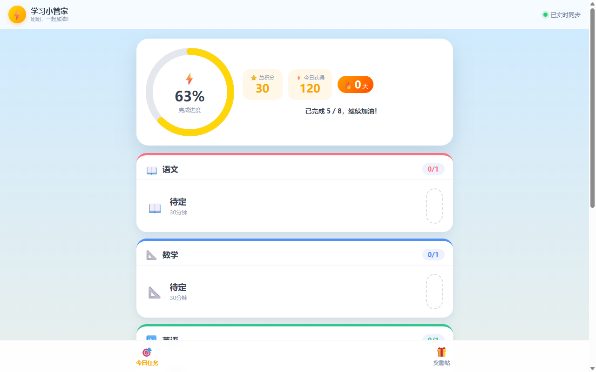
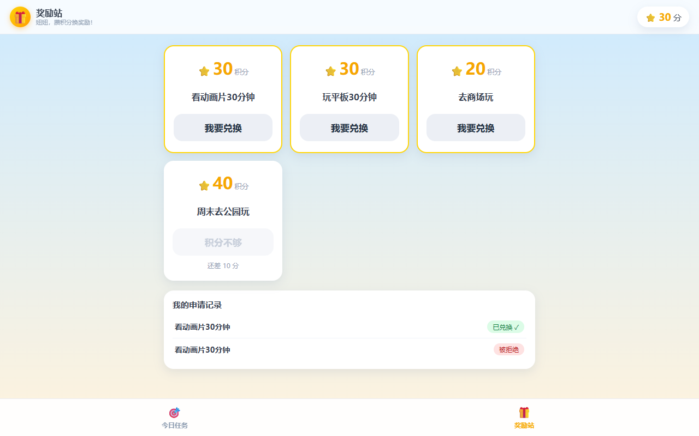
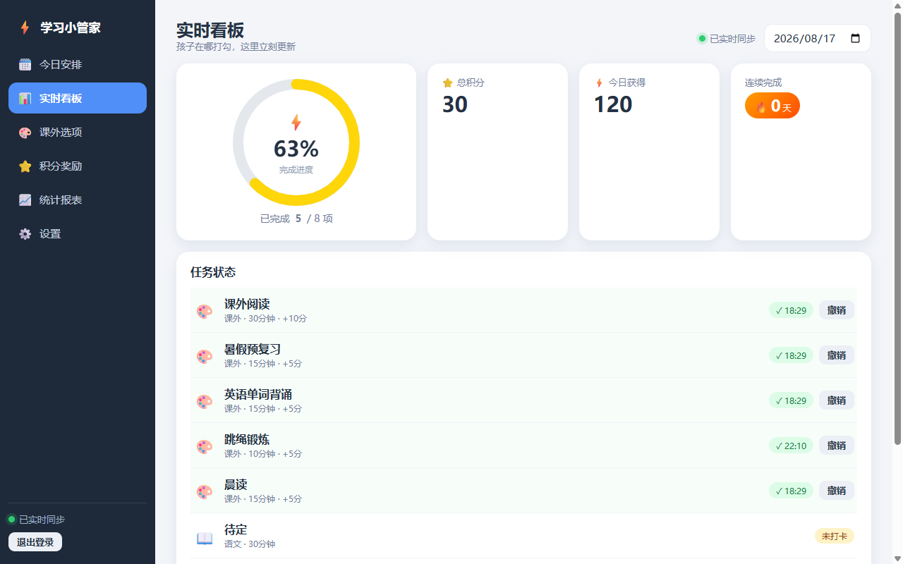
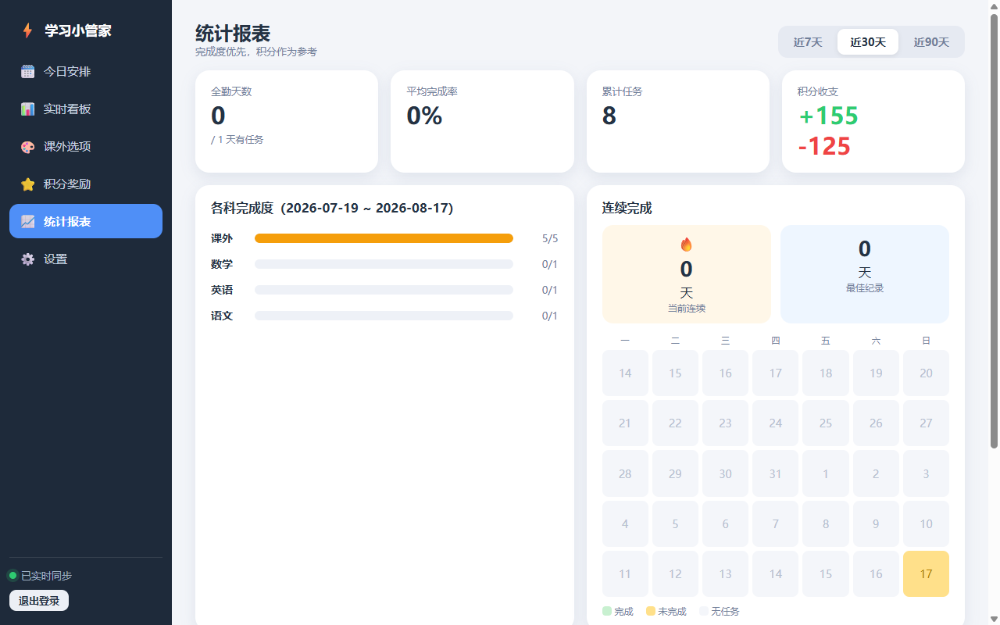

# ⚡ 学习小管家 / Homework Planner

小学学习管理台：家长布置任务、管理积分奖励；孩子打卡、攒积分换奖励。
A local-first homework & reward manager for primary school kids: parents plan tasks and manage points; kids check in and redeem rewards.

## 功能特性 Features

**家长端 /parent**（PIN 密码登录 / Parent-only, PIN login）
- 📅 今日安排：按语文/数学/英语布置当日作业 · Plan daily homework by subject
- 🎨 课外选项：维护课外任务池（打卡加分）· Maintain an extracurricular task pool (points earned on check-in)
- ⭐ 积分奖励：奖励档位管理 + 兑换申请审批（批准才扣分）· Reward tiers + redemption approval (points deducted only on approve)
- 📊 实时看板 · Live board
- 📈 统计报表：完成率、连续天数、各科完成度 · Completion stats, streaks, per-subject summary
- ⚙️ 设置：孩子称呼自定义、修改家长密码、局域网访问地址 · Child nickname, PIN change, LAN address

**孩子端 /child**（免登录，平板友好 / No auth, tablet-friendly）
- 🎯 今日任务打卡，完成时有动画庆祝 · Daily task check-in with celebration animation
- 🎁 奖励站：提交兑换申请、查看申请历史 · Redeem rewards, view request history

## 界面预览 Screenshots

| 孩子端 · 今日任务 Child · Tasks | 孩子端 · 奖励站 Child · Rewards |
| :-: | :-: |
|  |  |
| 家长端 · 实时看板 Parent · Board | 家长端 · 统计报表 Parent · Stats |
|  |  |

## 技术栈 Tech Stack

React 18 + Vite · Express · better-sqlite3 · WebSocket 实时同步 · 无外部服务
(React 18 + Vite, Express, better-sqlite3, WebSocket realtime sync, no external services)

## 快速开始 Quick Start

```bash
npm install
npm run dev    # 开发：server :8788 + vite :5173（浏览器访问 5173）
               # Dev: server :8788 + vite :5173 (open 5173)
npm run build  # 生产构建：dist-server/ + dist/
npm start      # 生产：:8787，提供 dist 静态页 / Production: :8787, serves dist/
```

## 使用方法 Usage

1. 浏览器打开 `http://localhost:8787` · Open in browser
2. 首次进入家长端设置 4-6 位 PIN 密码 · Set a 4-6 digit PIN on first visit
3. 平板连同一 WiFi，访问设置页显示的局域网地址，点「开始学习」· Tablet on same WiFi: open the LAN address from Settings, tap "开始学习"

## 数据与备份 Data & Backup

- 单文件 SQLite：`data/app.db`（任务、打卡、积分流水、兑换记录）· All data in one SQLite file
- `DB_PATH` 环境变量可改存储位置 · Override location with `DB_PATH`
- 备份 = 停止服务后复制该文件（WAL 模式，或连同 `-wal`/`-shm` 一起复制）· Stop the service before copying (WAL mode), or copy with `-wal`/`-shm`

## 部署 NAS Deploy to NAS

- 方案 A：NAS 安装 Node.js → `npm install` → `npm run build` → `npm start`，配置开机自启
  · Install Node.js on NAS, then build & start; configure auto-start
- 方案 B：Docker（`better-sqlite3` 原生模块需匹配 NAS 架构）· Docker (native module must match NAS architecture)
- 端口可用 `PORT` 环境变量修改；服务监听 `0.0.0.0` · Port configurable via `PORT`; listens on `0.0.0.0`

## 测试 Tests

```bash
npm test
```

## 项目结构 Structure

```
server/          Express 后端 · Backend
  routes/        每模块一个文件，统一在 routes/index.ts 注册 · One file per module, registered in routes/index.ts
  db.ts          数据库打开与迁移（migrations 数组）· DB open + migrations
  auth.ts        PIN 鉴权与内存会话 · PIN auth + in-memory sessions
  realtime.ts    WebSocket 实时广播 · WebSocket broadcast
src/             React 前端 · Frontend
  pages/parent/  家长端页面 · Parent pages
  pages/child/   孩子端页面 · Child pages
  components/meta.tsx  学科图标与颜色映射 · Subject icons & colors
  styles/        tokens.css（变量）/ base / parent / child
data/app.db      数据文件（自动创建，gitignore）· Data file (auto-created)
```

## 常见问题 FAQ

- 忘记家长密码？删除 `data/app.db` 重新初始化（会清空数据）· Forgot PIN? Delete `data/app.db` and re-init (data is cleared)
- 服务重启后家长端需重新登录（会话存内存）· Parent must re-login after server restart (sessions are in-memory)
